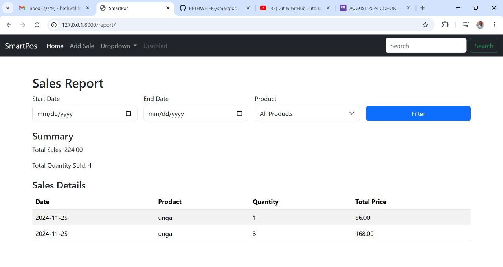
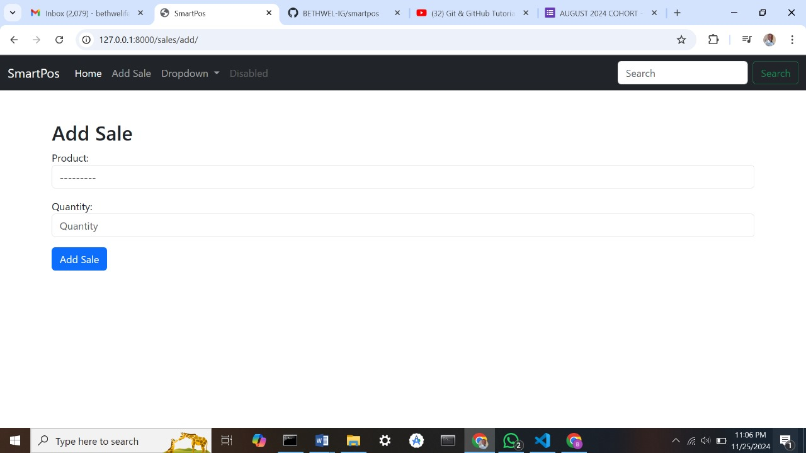
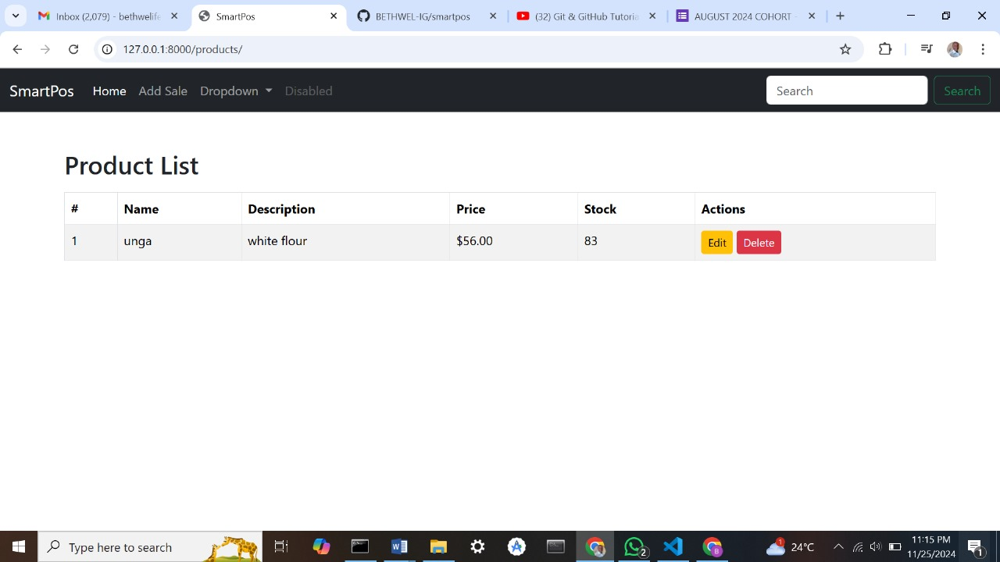
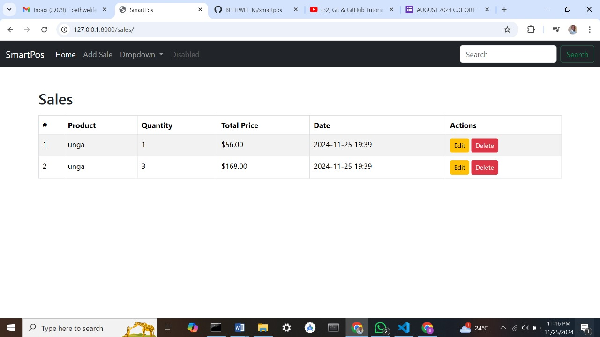

# SmartPOS
SmartPOS is a Django-based web application designed to provide small business owners with an affordable and portable POS solution.

## Features
- Track sales
- Manage inventory
- Generate sales reports

## Installation
1. Clone the repository.
2. Install dependencies: `pip install -r requirements.txt`.
3. Run migrations: `python manage.py migrate`.
4. Start the server: `python manage.py runserver`.

## Target Users
Small to medium-sized businesses in underserved areas.

